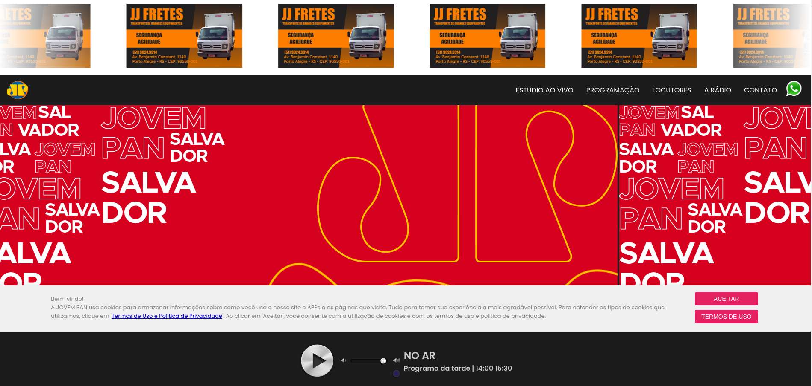
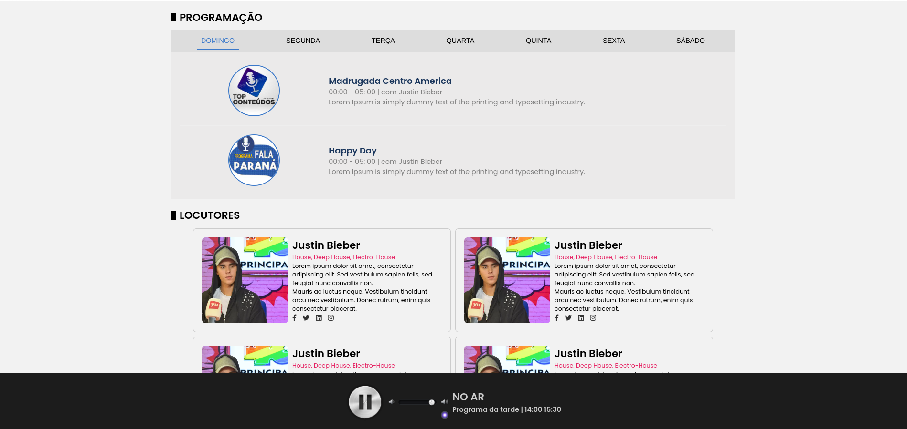
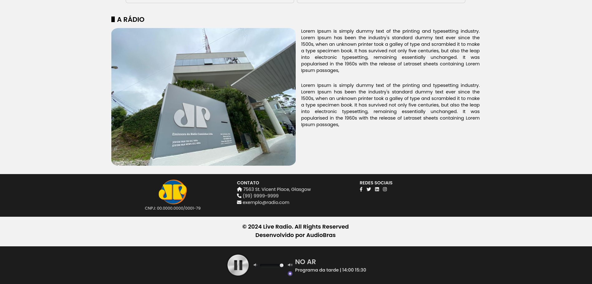

# PWA Site Radio

The project comprises HTML, CSS, and JavaScript files to create a dynamic and interactive website for broadcasting live radio, showcasing schedules, announcers, and station information.

## Features

- **Live Studio:** Experience live streaming from the studio using Clappr, an open-source media player.
- **Program Schedule:** View the detailed schedule of programs for each day of the week.
- **Announcers:** Learn about our talented announcers and their respective genres.
- **About the Radio:** Discover more about Live Radio and its history.
- **Contact:** Reach out to us via the provided contact information.

## Usage

To run this project locally:

1. Clone this repository to your local machine.
2. Open the `index.html` file in your preferred web browser.

## Technologies Used

- HTML5
- CSS3
- JavaScript
- Clappr (for live streaming)
- FontAwesome (for icons)
- Google Fonts (for typography)

## Screenshots

Here are some screenshots from the project:

    
    

    
    

## License

This project is licensed under the [MIT License](LICENSE).
